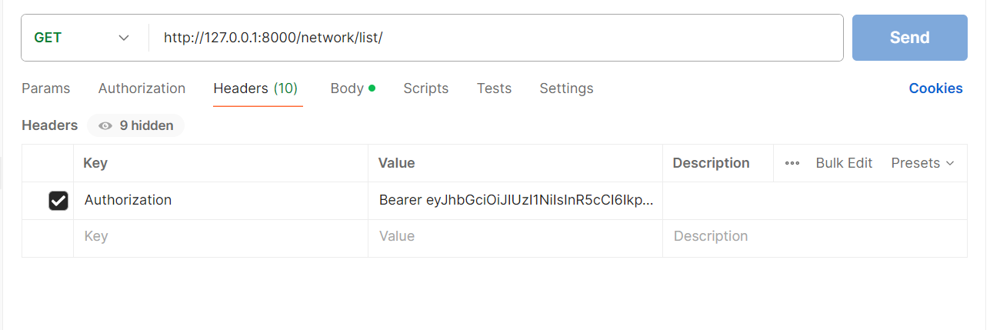

# онлайн платформа-торговой сети электроники
**Задание**

В данном задании вам предлагается разработать онлайн платформу-торговой сети электроники

Общая информация
1. Тестовое задание состоит из нескольких задач. Мы примем вашу кандидатуру к 
рассмотрению только в том случае, если работа выполнена целиком. 
Попытайтесь продемонстрировать ваш уровень опыта и навыков в каждой задаче, 
чтобы мы смогли в полной мере оценить вашу кандидатуру.

2. Вы должны отправить ваше готовое приложение в виде ссылки на GitHub- или 
GitLab-репозиторий. Если вы пришлете приложение в любом другом виде (в виде ссылки 
на zip-архив, прикрепите zip-архив к письму и др.), ваша кандидатура не будет нами 
рассмотрена!

3. Если вы сделали не все пункты тестового задания — пожалуйста, укажите причину, 
по которой вы их не выполнили (не хватило времени, не хватило опыта/знаний, что-то еще).

Технические требования
- Python 3.8+
- Django 3+
- DRF 3.10+
- PostgreSQL 10+

При выполнении тестового задания вы можете дополнительно использовать любые сторонние 
Python-библиотеки без всяких ограничений.

Задание
Создайте веб-приложение с API-интерфейсом и админ-панелью.
Создайте базу данных, используя миграции Django.

Требования к реализации:

1. Необходимо реализовать модель сети по продаже электроники.
Сеть должна представлять собой иерархическую структуру из трех уровней:

- завод;
- розничная сеть;
- индивидуальный предприниматель.
- 
Каждое звено сети ссылается только на одного поставщика оборудования 
(необязательно предыдущего по иерархии). Важно отметить, что уровень иерархии 
определяется не названием звена, а отношением к остальным элементам сети, т. е. 
завод всегда находится на уровне 0, а если розничная сеть относится напрямую к заводу, 
минуя остальные звенья, ее уровень — 1. 

2. Каждое звено сети должно обладать следующими элементами:
Название.
Контакты:
email,
страна,
город,
улица,
номер дома.
Продукты:
название,
модель,
дата выхода продукта на рынок.
Поставщик (предыдущий по иерархии объект сети).
Задолженность перед поставщиком в денежном выражении с точностью до копеек.
Время создания (заполняется автоматически при создании).

3. Сделать вывод в админ-панели созданных объектов.
На странице объекта сети добавить:

- Ссылку на «Поставщика»;
- фильтр по названию города;
- admin action, очищающий задолженность перед поставщиком у выбранных объектов.

4. Используя DRF, создать набор представлений:
CRUD для модели поставщика (запретить обновление через API поля «Задолженность перед поставщиком»).

Добавить возможность фильтрации объектов по определенной стране.

5. Настроить права доступа к API так, чтобы только активные сотрудники имели доступ к API.

### Настройка

1. установите необходимые переменные из .env-sample
2. Установите необходимые зависимости pip -r requirements.txt
3. создайте и примените миграции:
  3.1. python manage.py makemigrations 
  3.1. python manage.py migrate

4. Запустите приложение командой python manage.py runserver
5. в постман можно проверить контроллеры https://www.postman.com/
6. необходимо обязательно получить токен и внести его в запросе Postman в 
"headers", ключ: "Authorization" т.к. контроллеры доступны авторизированным 
пользователям с is_active = True
пример:

**Структура проекта**

# **config**

*config/urls.py* - Содержит шаблоны URL-адресов для всего проекта
- `/admin/`: Доступ к интерфейсу администратора Django.
- `/`: Корневой URL, включает в себя следующее:
  - `users/`: URL-адреса для приложения, связанного с пользователем
  - `online_platform/`: URL-адреса для основного приложения

*config/settings.py* - Содержит настройки проекта Django, Настройте переменные среды: 
Создайте файл ".env" на основе предоставленного файла " .env-sample" и 
введите необходимые значения

# **Online_platform**

*Online_platform/migrations*

Содержит миграции

*Online_platform/admin.py*

Этот файл определяет интерфейс администратора Django для приложения 
"online_platform". 

### Функции

- Пользовательские классы администратора модели:
    - `SupplierAdmin`: Предоставляет интерфейс для управления объектами `Supplier`. 
    - `ContactAdmin`: Предоставляет интерфейс для управления объектами `Contact`. 
    - `ProductAdmin`: Предоставляет интерфейс для управления объектами `Product`.
    - `NetworkAdmin`: Предоставляет интерфейс для управления объектами `Network` 
с дополнительной функциональностью.
- Отображение списка: устанавливает столбцы, отображаемые в виде списка для каждой 
модели.
- Фильтрация: Добавлены параметры фильтрации для каждой модели на основе определенных 
полей.
- Действия: Пользовательские действия администратора для `NetworkAdmin`:
    - `debt_delete`: Позволяет удалять задолженность выбранных поставщиков в модели 
`Network`.
- Пользовательская ссылка: метод `view_link` в `NetworkAdmin` создает интерактивную 
ссылку на страницу сведений о соответствующем поставщике.

### Зависимости

- `django.contrib.admin`
- `django.utils.html` 

### Использование

Этот файл автоматически загружается Django и предоставляет интерфейс для управления 
моделями в приложении "online_platform" в панели администратора Django.

### Примечания

- Атрибуты `list_display`, `list_filter` и `actions` используются для настройки 
интерфейса администратора для каждой модели.
- Функция `format_html` используется для генерации HTML-кода для пользовательской 
ссылки в методе `view_link`.

# **Online_platform/apps.py**

Это приложение Django под названием online_platform, которое содержит
основные параметры конфигурации для проекта онлайн-платформы

# **Online_platform/models.py**

Содержит модели Django для управления онлайн-платформой. 

## Модели

### Продукт

- **заголовок**: текстовое поле длиной не более 150 символов (подробное название: "название").
- **модель**: Текстовое поле, которое должно быть уникальным и иметь максимальную длину 150 символов (подробное название: "модель").
- **release_data**: поле даты и времени, которое автоматически заполняется текущей датой и временем (подробное название: "дата выхода продукта на рынок").

### Поставщик

- **заголовок**: текстовое поле длиной не более 150 символов (подробное название: "название").
- **уровень**: поле символов с несколькими вариантами выбора, представляющими такие уровни, как "завод", "родственная сеть", "индивидуальный предприниматель".
- **адрес электронной почты**: поле электронной почты, которое должно быть уникальным (подробное название: "электронная почта").
- **страна, город, улица, номер дома**: текстовые поля, в которых хранятся данные адреса.
- **продукты**: связь "Многие ко многим" с моделью продукта (подробное название: "продукты").
- **created_at**: поле даты и времени, которое автоматически заполняется текущей датой и временем (подробное название: "дата создания").

### Контакт

- **адрес электронной почты**: поле электронной почты, которое должно быть уникальным (подробное название: "электронная почта").
- **страна, город, улица, номер дома**: Текстовые поля, в которых хранятся сведения об адресе.

### Сеть

- **имя**: поле для ввода символов длиной не более 150 символов, которое должно быть уникальным (подробное имя: "название").
- **поставщик**: Связь внешнего ключа с моделью поставщика (при удалении: КАСКАДНАЯ).
- **supplier_debt**: Десятичное поле для хранения суммы долга (подробное название: "задолженность перед поставщиками").
- **контакт**: связь внешнего ключа с моделью контакта (при удалении: КАСКАД).

## URLs

- **get_absolute_url**: Возвращает URL-адрес сетевого экземпляра.

# **Online_platform/serializers.py**

### ProductSerializer

- Описание: Сериализатор для модели продукта.
- Поля: Включены все поля модели продукта.
  
### SupplierSerializer

- Описание: Сериализатор для модели поставщика.
- Поля: Включены все поля модели поставщика. 
Кроме того, поле уровня доступно только для чтения и включено в сериализацию.
  
### NetworkSerializer

- Описание: Сериализатор для сетевой модели.
- Поля: Включены все поля сетевой модели. Кроме того, поле supplier_debt 
доступно только для чтения и включено в сериализацию.
  
### ContactSerializer

- Описание: Сериализатор для контактной модели.
- Поля: включены все поля контактной модели.

# **Online_platform/tests.py**

Содержит тесты

# **Online_platform/urls.py**

### urls продукта
- Создайте продукт: /product/create/
- Обновить продукт: /product/update/<int:pk>/
- Извлекаем продукт: /product/retrieve/<int:pk>/
- Удаляем продукт: /product/destroy/<int:pk>/

### urls поставщика
- Создаем поставщика: /supplier/create/
- Обновляем поставщика: /supplier/update/<int:pk>/
- Получить поставщика: /supplier/retrieve/<int:pk>/
- Удалить поставщика: /supplier/destroy/<int:pk>/
- Список поставщиков: /supplier/list/

### urls сети
- Создать сеть: /network/create/
- Обновить сеть: /network/update/<int:pk>/
- Восстановить сеть: /network/retrieve/<int:pk>/
- Удалить сеть: /network/destroy/<int:pk>/
- Список сети: /network/list/

### urls контактов
- Создать контакт: /contact/create/
- Обновить контакт: /contact/update/<int:pk>/
- Восстановить контакт: /contact/retrieve/<int:pk>/
- Удалить контакт: /contact/destroy/<int:pk>/
- Список контактов: /contact/list/

# **Online_platform/views.py**

Контроллеры доступны только активным пользователям

### продукт
- Создайте продукт: /product/create/
- Обновить продукт: /product/update/<int:pk>/
- Извлекаем продукт: /product/retrieve/<int:pk>/
- Удаляем продукт: /product/destroy/<int:pk>/

### поставщик
- Создаем поставщика: /supplier/create/
- Обновляем поставщика: /supplier/update/<int:pk>/
- Получить поставщика: /supplier/retrieve/<int:pk>/
- Удалить поставщика: /supplier/destroy/<int:pk>/
- Список поставщиков: /supplier/list/

### сеть
- Создать сеть: /network/create/
- Обновить сеть: /network/update/<int:pk>/
- Восстановить сеть: /network/retrieve/<int:pk>/
- Удалить сеть: /network/destroy/<int:pk>/
- Список сети: /network/list/

### контакты
- Создать контакт: /contact/create/
- Обновить контакт: /contact/update/<int:pk>/
- Восстановить контакт: /contact/retrieve/<int:pk>/
- Удалить контакт: /contact/destroy/<int:pk>/
- Список контактов: /contact/list/
 
# **users/migrations** 

Содержит миграции

# **users/admin.py**

# **users/apps.py**

# **users/models.py**

# **users/serializers.py**

# **users/tests.py**

# **users/urls.py**

# **users/views.py**

# **.env-sample**

Этот файл является образцом файла ".env", который вы можете 
использовать для настройки вашего проекта Django. Очень важно создать файл ".env" 
на основе этого образца и заполнить необходимую информацию перед запуском проекта.

# **./flake8**

### Конфигурация Flake8

Максимальная длина строки max-line-length = 120
Параметр max-line-length в Flake8 определяет максимально допустимую длину строки в вашем коде. 
Строки, превышающие указанную длину, будут вызывать предупреждения.

### Исключенные каталоги и файлы

exclude = migrations, poetry.black, poetry.toml
Параметр exclude в Flake8 позволяет указать каталоги или файлы, которые должны быть исключены из процесса компоновки.
В данном случае это каталог migrations, poetry.файл блокировки и файл poetry.toml исключены из списка.

# **.gitignore** 

Содержит папки и файлы, которые требуется исключить из отслеживания Git

Пример запроса с фильтрацией http://127.0.0.1:8000/supplier/list/?country=США

