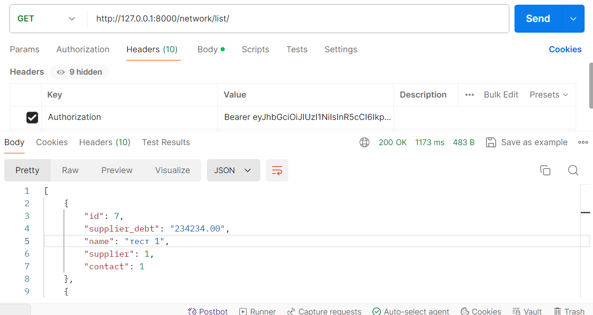
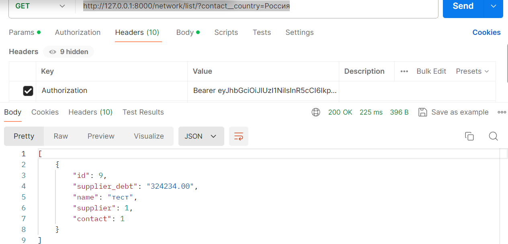

# онлайн платформа-торговой сети электроники

# **Задание**

В данном задании вам предлагается разработать онлайн платформу-торговой сети электроники

Общая информация
1. Тестовое задание состоит из нескольких задач. Мы примем вашу кандидатуру к 
рассмотрению только в том случае, если работа выполнена целиком. 
Попытайтесь продемонстрировать ваш уровень опыта и навыков в каждой задаче, 
чтобы мы смогли в полной мере оценить вашу кандидатуру.

2. Вы должны отправить ваше готовое приложение в виде ссылки на GitHub- или 
GitLab-репозиторий. Если вы пришлете приложение в любом другом виде (в виде ссылки 
на zip-архив, прикрепите zip-архив к письму и др.), ваша кандидатура не будет нами 
рассмотрена!

3. Если вы сделали не все пункты тестового задания — пожалуйста, укажите причину, 
по которой вы их не выполнили (не хватило времени, не хватило опыта/знаний, что-то еще).

Технические требования
- Python 3.8+
- Django 3+
- DRF 3.10+
- PostgreSQL 10+

При выполнении тестового задания вы можете дополнительно использовать любые сторонние 
Python-библиотеки без всяких ограничений.

Задание
Создайте веб-приложение с API-интерфейсом и админ-панелью.
Создайте базу данных, используя миграции Django.

Требования к реализации:

1. Необходимо реализовать модель сети по продаже электроники.
Сеть должна представлять собой иерархическую структуру из трех уровней:

- завод;
- розничная сеть;
- индивидуальный предприниматель.

Каждое звено сети ссылается только на одного поставщика оборудования 
(необязательно предыдущего по иерархии). Важно отметить, что уровень иерархии 
определяется не названием звена, а отношением к остальным элементам сети, т. е. 
завод всегда находится на уровне 0, а если розничная сеть относится напрямую к заводу, 
минуя остальные звенья, ее уровень — 1. 

2. Каждое звено сети должно обладать следующими элементами:
Название.
Контакты:
email,
страна,
город,
улица,
номер дома.
Продукты:
название,
модель,
дата выхода продукта на рынок.
Поставщик (предыдущий по иерархии объект сети).
Задолженность перед поставщиком в денежном выражении с точностью до копеек.
Время создания (заполняется автоматически при создании).

3. Сделать вывод в админ-панели созданных объектов.
На странице объекта сети добавить:

- Ссылку на «Поставщика»;
- фильтр по названию города;
- admin action, очищающий задолженность перед поставщиком у выбранных объектов.

4. Используя DRF, создать набор представлений:
CRUD для модели поставщика (запретить обновление через API поля «Задолженность перед поставщиком»).

Добавить возможность фильтрации объектов по определенной стране.

5. Настроить права доступа к API так, чтобы только активные сотрудники имели доступ к API.

### Настройка

1. установите необходимые переменные из .env-sample
2. Установите необходимые зависимости pip -r requirements.txt
3. создайте суперпользвателя командой python manage.py scu
4. создайте и примените миграции:
  3.1. python manage.py makemigrations 
  3.1. python manage.py migrate

5. Загрузите данные в свою БД командой:
python manage.py loaddata online_platform.json

6. Запустите приложение командой python manage.py runserver
7. в постман можно проверить контроллеры https://www.postman.com/
8. необходимо обязательно получить токен и внести его в запросе Postman в 
"headers", ключ: "Authorization" т.к. контроллеры доступны авторизированным 
пользователям с is_active = True
пример:

# **Структура проекта**

# *config/urls.py*

Содержит шаблоны URL-адресов для всего проекта
- `/admin/`: Доступ к интерфейсу администратора Django.
- `/`: Корневой URL, включает в себя следующее:
  - `users/`: URL-адреса для приложения, связанного с пользователем
  - `online_platform/`: URL-адреса для основного приложения

# *config/settings.py* 

Содержит настройки проекта Django, Настройте переменные среды: 
Создайте файл ".env" на основе предоставленного файла " .env-sample" и 
введите необходимые значения

# *Online_platform/migrations*

Содержит миграции

# *Online_platform/admin.py*

Этот файл определяет интерфейс администратора Django для приложения 
"online_platform". 

### Функции

- Пользовательские классы администратора модели:
    - `SupplierAdmin`: Предоставляет интерфейс для управления объектами `Supplier`. 
    - `ContactAdmin`: Предоставляет интерфейс для управления объектами `Contact`. 
    - `ProductAdmin`: Предоставляет интерфейс для управления объектами `Product`.
    - `NetworkAdmin`: Предоставляет интерфейс для управления объектами `Network` 
с дополнительной функциональностью.
- Отображение списка: устанавливает столбцы, отображаемые в виде списка для каждой 
модели.
- Фильтрация: Добавлены параметры фильтрации для каждой модели на основе определенных 
полей.
- Действия: Пользовательские действия администратора для `NetworkAdmin`:
    - `debt_delete`: Позволяет удалять задолженность выбранных поставщиков в модели 
`Network`.
- Пользовательская ссылка: метод `view_link` в `NetworkAdmin` создает интерактивную 
ссылку на страницу сведений о соответствующем поставщике.

### Зависимости

- `django.contrib.admin`
- `django.utils.html` 

### Использование

Этот файл автоматически загружается Django и предоставляет интерфейс для управления 
моделями в приложении "online_platform" в панели администратора Django.

### Примечания

- Атрибуты `list_display`, `list_filter` и `actions` используются для настройки 
интерфейса администратора для каждой модели.
- Функция `format_html` используется для генерации HTML-кода для пользовательской 
ссылки в методе `view_link`.

# *Online_platform/apps.py*

Это приложение Django под названием online_platform, которое содержит
основные параметры конфигурации для проекта онлайн-платформы

# *Online_platform/models.py*

Содержит модели Django для управления онлайн-платформой. 

## Модели

### Продукт

- **заголовок**: текстовое поле длиной не более 150 символов (подробное название: "название").
- **модель**: Текстовое поле, которое должно быть уникальным и иметь максимальную длину 150 символов (подробное название: "модель").
- **release_data**: поле даты и времени, которое автоматически заполняется текущей датой и временем (подробное название: "дата выхода продукта на рынок").

### Поставщик

- **заголовок**: текстовое поле длиной не более 150 символов (подробное название: "название").
- **уровень**: поле символов с несколькими вариантами выбора, представляющими такие уровни, как "завод", "родственная сеть", "индивидуальный предприниматель".
- **адрес электронной почты**: поле электронной почты, которое должно быть уникальным (подробное название: "электронная почта").
- **страна, город, улица, номер дома**: текстовые поля, в которых хранятся данные адреса.
- **продукты**: связь "Многие ко многим" с моделью продукта (подробное название: "продукты").
- **created_at**: поле даты и времени, которое автоматически заполняется текущей датой и временем (подробное название: "дата создания").

### Контакт

- **адрес электронной почты**: поле электронной почты, которое должно быть уникальным (подробное название: "электронная почта").
- **страна, город, улица, номер дома**: Текстовые поля, в которых хранятся сведения об адресе.

### Сеть

- **имя**: поле для ввода символов длиной не более 150 символов, которое должно быть уникальным (подробное имя: "название").
- **поставщик**: Связь внешнего ключа с моделью поставщика (при удалении: КАСКАДНАЯ).
- **supplier_debt**: Десятичное поле для хранения суммы долга (подробное название: "задолженность перед поставщиками").
- **контакт**: связь внешнего ключа с моделью контакта (при удалении: КАСКАД).

## URLs

- **get_absolute_url**: Возвращает URL-адрес сетевого экземпляра.

# *Online_platform/serializers.py*

### ProductSerializer

- Описание: Сериализатор для модели продукта.
- Поля: Включены все поля модели продукта.
  
### SupplierSerializer

- Описание: Сериализатор для модели поставщика.
- Поля: Включены все поля модели поставщика. 
Кроме того, поле уровня доступно только для чтения и включено в сериализацию.
  
### NetworkSerializer

- Описание: Сериализатор для сетевой модели.
- Поля: Включены все поля сетевой модели. Кроме того, поле supplier_debt 
доступно только для чтения и включено в сериализацию.
  
### ContactSerializer

- Описание: Сериализатор для контактной модели.
- Поля: включены все поля контактной модели.

# *Online_platform/tests.py*

Содержит тесты

# *Online_platform/urls.py*

## URL-адреса продуктов
- /product/create/: Создать новый продукт (ProductCreateApiView)
- /product/update/<int:pk>/: Обновить продукт по его идентификатору (ProductUpdateApiView)
- /product/retrieve/<int:pk>/: Извлекает продукт по его идентификатору (ProductRetrieveApiView)
- /product/destroy/<int:pk>/: Уничтожить или удалить продукт по его идентификатору (ProductDestroyApiView)

## URL-адреса поставщиков
- /supplier/create/: Создать нового поставщика (SupplierCreateApiView)
- /supplier/update/<int:pk>/: Обновить поставщика по его идентификатору (SupplierUpdateApiView)
- /поставщик/извлечение/<int:pk>/: Извлечение поставщика по его идентификатору (SupplierRetrieveApiView)
- /поставщик/уничтожение/<int:pk>/: Уничтожение или удаление поставщика по его идентификатору (SupplierDestroyApiView)
- /список поставщиков/: Список всех поставщиков (SupplierListApiView)

## URL-адреса сети
- /сеть/создать/: Создать новую сеть (NetworkCreateApiView)
- /сеть/обновить/<int:pk>/: Обновить сеть по ее идентификатору (NetworkUpdateApiView)
- /network/retrieve/<int:pk>/: Извлекает сеть по ее идентификатору (NetworkRetrieveApiView)
- /сеть/уничтожить/<int:pk>/: Уничтожить или удалить сеть по ее идентификатору (NetworkDestroyApiView)
- /сеть/список/: Список всех сетей (NetworkListApiView)

## Адреса контактов
- /контакт/создать/: Создать новый контакт (ContactCreateApiView)
- /contact/обновить/<int:pk>/: Обновить контакт по его идентификатору (ContactUpdateApiView)
- /contact/получить/<int:pk>/: Получить контакт по его идентификатору (ContactRetrieveApiView)
- /contact/destroy/<int:pk>/: Уничтожить или удалить контакт по его идентификатору (ContactDestroyApiView)
- /contact/list/: Список всех контактов (ContactListApiView)

# *Online_platform/views.py*

## Описание
Этот код представляет собой набор классов для работы с API пользователей. 
Он включает в себя возможность создания, редактирования, просмотра и удаления 
различных моделей, таких как Продукт, поставщик, сеть и контакт.

## API продукта

## Класс ProductCreateApiView
- Описание: создания нового продукта
- serializerclass: ProductSerializer
- требуется разрешение IsActiveUser.

## Класс ProductUpdateApiView
- Описание: для обновления существующего продукта
- serializerclass: ProductSerializer
- требуется разрешение IsActiveUser.

## Класс ProductRetrieveApiView
- Описание: для получения сведений об одном продукте
- serializerclass: ProductSerializer
- требуется разрешение IsActiveUser.

## Класс ProductListApiView
- Описание: для получения списка всех продуктов
- serializerclass: ProductSerializer
- требуется разрешение IsActiveUser.

## Класс ProductDestroyApiView
- Описание: для удаления продукта
- serializerclass: ProductSerializer
- требуется разрешение IsActiveUser.

## API поставщика

## Класс SupplierCreateApiView
- Описание: создания нового поставщика
- serializerclass: SupplierSerializer
- требуется разрешение IsActiveUser.

## Класс SupplierUpdateApiView
- Описание: для обновления существующего поставщика
- serializerclass: SupplierSerializer
- требуется разрешение IsActiveUser.

## Класс SupplierRetrieveApiView
- Описание: для получения сведений о поставщике
- serializerclass: SupplierSerializer
- требуется разрешение IsActiveUser.

## Класс SupplierListApiView
- Описание: для получения списка всех поставщиков
- serializerclass: SupplierSerializer
- требуется разрешение IsActiveUser.

## Класс SupplierDestroyApiView
- Описание: для удаления поставщика
- serializerclass: SupplierSerializer
- требуется разрешение IsActiveUser.

## Сетевые API

## Класс NetworkCreateApiView
- Описание: создания новой сети
- serializerclass: NetworkSerializer
- требуется разрешение IsActiveUser.

## Класс NetworkUpdateApiView
- Описание: для обновления существующей сети
- serializerclass: NetworkSerializer
- требуется разрешение IsActiveUser.

## Класс NetworkRetrieveApiView
- Описание: для получения сведений о сети
- serializerclass: NetworkSerializer
- требуется разрешение IsActiveUser.

## Класс NetworkListApiView
- Описание: для получения списка всех сетей
- serializerclass: NetworkSerializer
- требуется разрешение IsActiveUser.

## Класс NetworkDestroyApiView
- Описание: для удаления сети
- serializerclass: NetworkSerializer
- требуется разрешение IsActiveUser.

## API контактов

## Класс ContactCreateApiView
- Описание: создания нового контакта
- serializerclass: ContactSerializer
- требуется разрешение IsActiveUser.

## Класс ContactUpdateApiView
- Описание: для обновления существующего контакта
- serializerclass: ContactSerializer
- требуется разрешение IsActiveUser.

## Класс ContactRetrieveApiView
- Описание: для получения сведений о контакте
- serializerclass: ContactSerializer
- требуется разрешение IsActiveUser.

## Класс ContactListApiView
- Описание: для получения списка всех контактов
- serializerclass: ContactSerializer
- требуется разрешение IsActiveUser.

## Класс ContactDestroyApiView
- Описание: для удаления контакта
- serializerclass: ContactSerializer
- требуется разрешение IsActiveUser.

# *users/migrations* 

Содержит миграции

# *users/admin.py*

### Администратор пользовательской модели
- Декоратор @admin.register(пользователь) регистрирует пользовательскую модель в 
панели администратора.
- Класс UserAdmin расширяет возможности admin.ModelAdmin и предоставляет 
пользовательские настройки для пользовательской модели в панели администратора.
- Атрибут list_display указывает поля, которые будут отображаться в виде списка 
пользователей в панели администратора. В данном случае отображаются поля 
"имя пользователя" и "адрес электронной почты".

# *users/apps.py*

# *users/models.py*

Этот код представляет собой объявление модели User, который наследуется от 
AbstractUser в Django. В данном случае, модель пользователя содержит два поля: 
is_active и owner.

### Подробности кода
- **is_active:** Это поле типа boolean, которое по умолчанию равно True и отвечает 
за активность пользователя.
- **owner:** Это поле ForeignKey, которое связывает пользователя с другим 
пользователем (settings.AUTH_USER_MODEL). 
Здесь использован **NULLABLE = {'null': True, 'blank': True}** для позволения 
сохранения пустых значений и значений null.

### Метаданные
- **verbose_name:** 'пользователь'
- **verbose_name_plural:** 'пользователи'

### Другая информация
Пожалуйста, убедитесь, что импортированы необходимые модули и значения 
settings.AUTH_USER_MODEL определены корректно. 

# *users/serializers.py*

### Краткое описание
- UserSerializer: Это сериализатор для модели User, который наследуется от 
serializers.ModelSerializer.
- Meta: Внутренний класс Meta содержит метаданные для сериализатора

### Подробности кода
- model: Указывает модель, которая будет сериализоваться.
- exclude: Исключает указанные поля из сериализации. В данном случае, исключается 
поле 'owner'.

# *users/tests.py*

Cодержит тесты для модели user

# *users/urls.py*

Данный код представляет собой определение маршрутов (URL-шаблонов) в Django 
REST framework. URL-шаблоны используются для привязки определенных URL к 
определенным видам (views) в Django приложениях.

### Краткое описание
В приведенном коде определены следующие URL-шаблоны:
- user/create/ - Создание нового пользователя.
- user/update/<int:pk>/ - Обновление информации о пользователе с указанным идентификатором.
- user/retrieve/<int:pk>/ - Получение информации о пользователе по его идентификатору.
- user/destroy/<int:pk>/ - Удаление пользователя с указанным идентификатором.
- api/token/ - Получение JWT-токена для аутентификации пользователя.
- api/token/refresh/ - Обновление JWT-токена.

### Подробности кода
- UserCreateApiView: Обработчик для создания нового пользователя.
- UserUpdateApiView: Обработчик для обновления информации о пользователе.
- UserRetrieveApiView: Обработчик для получения информации о пользователе.
- UserDestroyApiView: Обработчик для удаления пользователя.
- TokenObtainPairView: Обработчик для получения пары токенов доступа и обновления.
- TokenRefreshView: Обработчик для обновления токена доступа.

# *users/views.py*

## Описание
Этот код представляет собой набор классов для работы с API пользователей. 
Он включает в себя возможность создания, редактирования, просмотра и удаления 
пользователей.

## Класс UserCreateApiView
- Описание: Создание пользователя
- serializerclass: UserSerializer
- Метод performcreate: Создает нового пользователя, устанавливает 'owner' и 
сохраняет пользователя.

## Класс UserUpdateApiView
- Описание: Редактирование пользователя
- serializerclass: UserSerializer
- queryset: Все пользователи
- permissionclasses: IsActiveUser

## Класс UserRetrieveApiView
- Описание: Просмотр пользователей
- serializerclass: UserSerializer
- queryset: Все пользователи
- permissionclasses: IsActiveUser

## Класс UserDestroyApiView
- Описание: Удаление пользователя
- serializerclass: UserSerializer
- queryset: Все пользователи
- permissionclasses: IsActiveUser

 

# *.env-sample*

Этот файл является образцом файла ".env", который вы можете 
использовать для настройки вашего проекта Django. Очень важно создать файл ".env" 
на основе этого образца и заполнить необходимую информацию перед запуском проекта.

# *./flake8*

### Конфигурация Flake8

Максимальная длина строки max-line-length = 120
Параметр max-line-length в Flake8 определяет максимально допустимую длину строки в вашем коде. 
Строки, превышающие указанную длину, будут вызывать предупреждения.

### Исключенные каталоги и файлы

exclude = migrations, poetry.black, poetry.toml
Параметр exclude в Flake8 позволяет указать каталоги или файлы, которые должны быть исключены из процесса компоновки.
В данном случае это каталог migrations, poetry.файл блокировки и файл poetry.toml исключены из списка.

# *.gitignore* 

Содержит папки и файлы, которые требуется исключить из отслеживания Git

# *Примеры запросов в Postman:*

1. учетные данные суперпользвателя для postman post запросе http://127.0.0.1:8000/api/token/: 
{
    "username": "admin",
    "password": 1234
}

2. пример запроса http://127.0.0.1:8000/network/list/ - вывод списка всех сетей

3. пример post запроса http://127.0.0.1:8000/network/create/ - создание сети

4. Пример get запроса с фильтрацией 
http://127.0.0.1:8000/supplier/list/?country=США
http://127.0.0.1:8000/network/list/?contact__country=Россия

